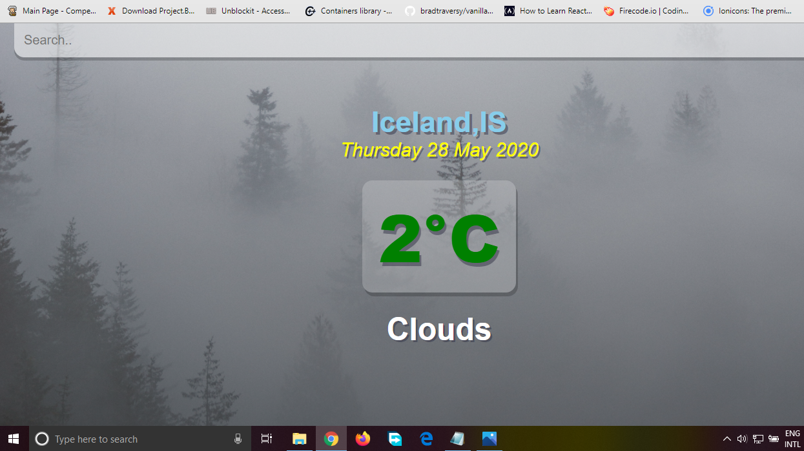
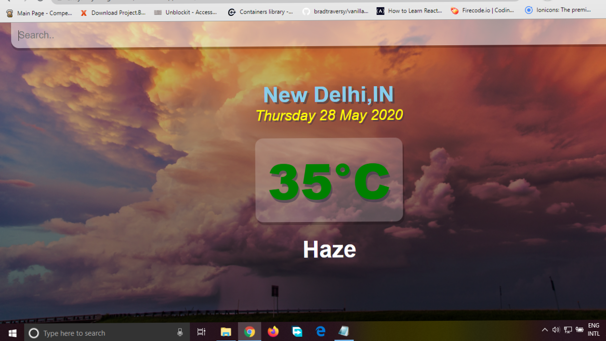

<h1>Weather App </h1>
 

 Created using ReactJs and API

Used OpenWeather website data related to weather by fetching the data through API. 

<a href = "https://anujaditya02.github.io/Weather-App-React/" >Weather App </a>

<h2>ScreenShots</h2>

 
  
  
 
